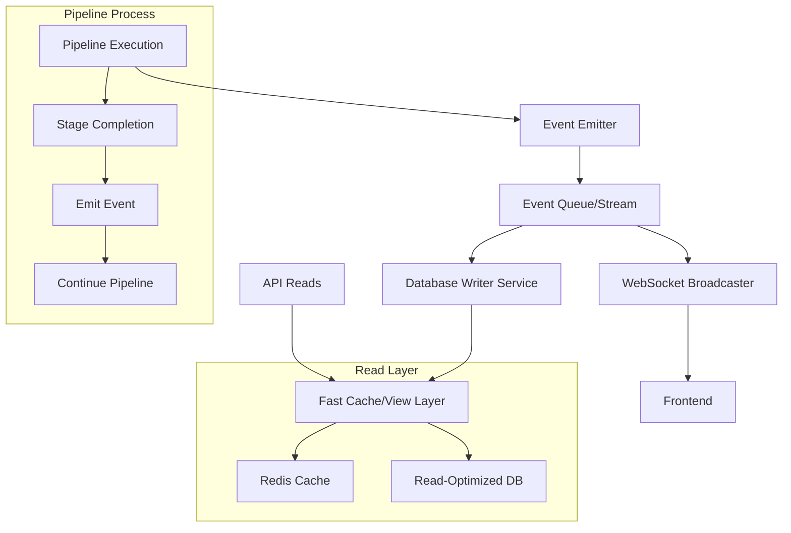
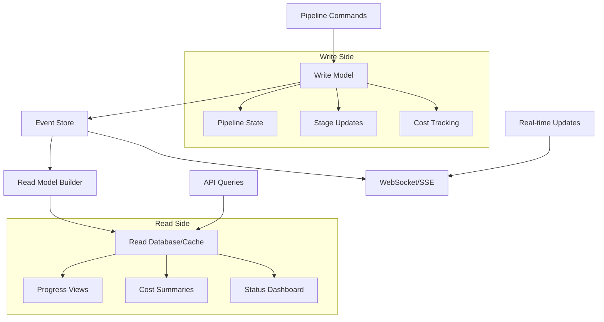
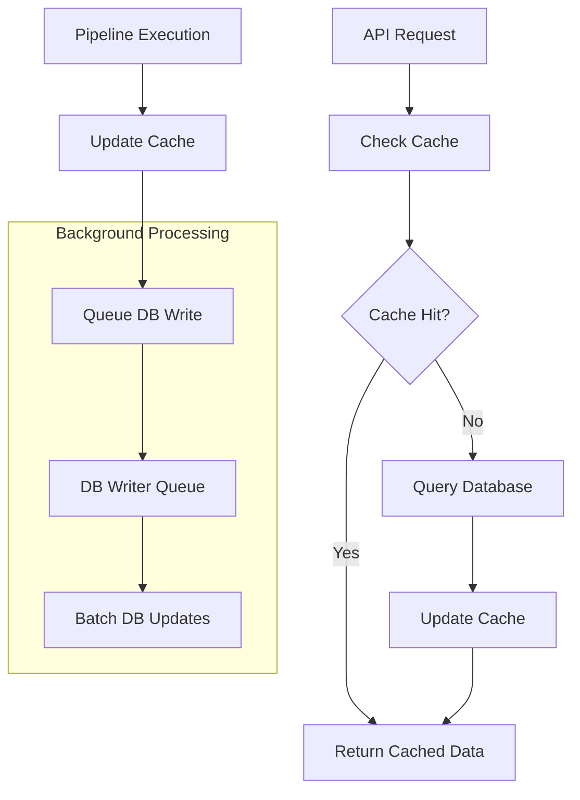

# Database Architecture Improvement Plan (Archived)

> **Status Update (December 2024): This plan is now considered ARCHIVED and OBSOLETE.**
>
> The critical performance issues described in this document (database contention, UI blocking) have been fully resolved by a subsequent, more direct architectural enhancement.
>
> **Root Cause Resolution**: The core problem was addressed by migrating the application to a **fully asynchronous database stack** (using `aiosqlite` and `async-sqlmodel`). This change ensures that no database operation blocks the `asyncio` event loop, allowing the API to respond instantly even while database writes are in flight.
>
> This solution was implemented as part of the `ENHANCEMENT_PLAN.md`, which proved to be a more effective and direct resolution than the caching or queue-based architectures proposed below. The proposals in this document are no longer necessary for solving the original problem.

## Executive Summary

The current pipeline progress tracking system suffers from database contention issues that cause UI blocking and poor user experience. This document outlines a comprehensive plan to redesign the architecture for better performance, reliability, and scalability.

## Current Issues Analysis

### 🚨 Critical Problems

1. **Database Contention**
   - Pipeline execution synchronously writes to `PipelineStage` table after each stage
   - API reads from same table get blocked by write transactions
   - Causes 20+ second delays in UI content loading
   - Tight coupling between pipeline execution and database state

2. **Real-time Updates Fragility**
   - WebSocket connections frequently fail/timeout through ngrok
   - Multiple failure points: database writes AND WebSocket must both work
   - No graceful degradation when WebSocket fails
   - Frontend depends entirely on successful WebSocket connection

3. **Synchronous API Design**
   - `getRun()` tries to fetch everything at once
   - Blocking behavior when database is under write load
   - No partial data loading or progressive enhancement
   - All-or-nothing approach to data fetching

4. **Poor Error Handling**
   - Network timeouts cause complete UI failure
   - No retry mechanisms or fallback strategies
   - User experience degrades completely when issues occur

## Proposed Architecture Solutions

### Option 1: Event-Driven Architecture ⭐ (Recommended)



**Key Benefits:**
- **Non-blocking pipeline execution** - never waits for database
- **Fast API responses** from cache layer
- **Resilient real-time updates** with fallback mechanisms
- **Horizontal scalability** for multiple pipeline instances

### Option 2: CQRS (Command Query Responsibility Segregation)



**Key Benefits:**
- **Separate optimized** read and write stores
- **Eventually consistent** but never blocking
- **Multiple read views** optimized for different use cases
- **Complete audit trail** of all pipeline events

### Option 3: Cache-First Architecture (Quick Win)



**Key Benefits:**
- **Immediate performance improvement** with minimal changes
- **Low implementation complexity**
- **Backward compatible** with existing system
- **Foundation** for more advanced architectures

## Implementation Plan

### Phase 1: Quick Wins (1-2 days) 🚀

**Goal:** Eliminate immediate blocking issues with minimal code changes

#### 1.1 Add Redis Cache Layer

```python
# New cache service
class PipelineProgressCache:
    def __init__(self):
        self.redis = redis.Redis(host='redis', port=6379, db=0)
    
    async def update_stage(self, run_id: str, stage_data: dict):
        """Update stage progress in cache immediately"""
        cache_key = f"run:{run_id}:stages"
        await self.redis.hset(cache_key, stage_data['stage_name'], json.dumps(stage_data))
        await self.redis.expire(cache_key, 3600)  # 1 hour TTL
    
    async def get_stages(self, run_id: str) -> List[dict]:
        """Get all stages from cache"""
        cache_key = f"run:{run_id}:stages"
        cached_stages = await self.redis.hgetall(cache_key)
        return [json.loads(stage) for stage in cached_stages.values()]
```

#### 1.2 Cache-First API Reads

```python
@runs_router.get("/{run_id}", response_model=PipelineRunDetail)
async def get_pipeline_run(run_id: str):
    """Get run details with cache-first approach"""
    
    # Get basic run info from database
    run = await get_run_basic_info(run_id)
    
    # Try cache first for stages
    try:
        stages = await cache.get_stages(run_id)
        if not stages:
            # Fallback to database with aggressive timeout
            stages = await fetch_stages_with_timeout(run_id, timeout=1.0)
    except Exception:
        # If all fails, return run without stages
        stages = []
    
    return build_run_response(run, stages)
```

#### 1.3 Async Database Writes

```python
# Background queue for database writes
class DatabaseWriteQueue:
    def __init__(self):
        self.queue = asyncio.Queue()
        self.worker_task = asyncio.create_task(self._process_writes())
    
    async def queue_stage_update(self, run_id: str, stage_data: dict):
        """Queue stage update for async processing"""
        await self.queue.put(('update_stage', run_id, stage_data))
    
    async def _process_writes(self):
        """Background worker to process database writes"""
        while True:
            try:
                operation, run_id, data = await self.queue.get()
                await self._execute_db_write(operation, run_id, data)
            except Exception as e:
                logger.error(f"Database write failed: {e}")
            finally:
                self.queue.task_done()
```

#### 1.4 Enhanced Error Handling

```python
# Fallback mechanisms for API calls
class RobustAPIClient:
    async def get_run_with_fallback(self, run_id: str):
        """Get run data with multiple fallback strategies"""
        
        # Strategy 1: Cache + minimal DB
        try:
            return await self.get_run_cached(run_id)
        except Exception:
            pass
        
        # Strategy 2: Database with timeout
        try:
            return await asyncio.wait_for(
                self.get_run_database(run_id), 
                timeout=2.0
            )
        except Exception:
            pass
        
        # Strategy 3: Basic run info only
        return await self.get_run_basic_info(run_id)
```

**Expected Results:**
- API response time: 20+ seconds → **<500ms**
- UI content loading: Blocked → **Immediate**
- Error resilience: Fragile → **Graceful degradation**

#### 1.5 Managing Data Consistency and User Perception

**Goal:** Ensure the user always sees a consistent and logical progression of the pipeline, even if the cache and database are momentarily out of sync.

**Problem:** With asynchronous database writes, there's a small window where the cache (seen by the user) is more up-to-date than the database. If a user refreshes the page at the wrong moment, they might see the progress "jump" backward before the WebSocket reconnects and corrects it.

**Solution:** Implement a "versioning" or "timestamping" mechanism in the frontend to handle out-of-order or stale data gracefully.

```typescript
// front_end/src/components/RunResults.tsx

// Add a state to track the last seen update timestamp
const [lastUpdateTimestamp, setLastUpdateTimestamp] = useState<string | null>(null);

const handleStageUpdate = (newStageData: StageData) => {
    // Only process the update if it's newer than what we've already seen
    if (newStageData.timestamp > lastUpdateTimestamp) {
        setRunDetails(prevDetails => {
            // Logic to update stages in the runDetails state
            const updatedDetails = ...; 
            return updatedDetails;
        });
        setLastUpdateTimestamp(newStageData.timestamp);
    } else {
        // Log that we've ignored a stale update
        console.log(`Ignoring stale stage update for ${newStageData.stage_name}.`);
    }
};

const fetchRunDetails = async () => {
    // When fetching initial data, set the timestamp from the latest stage
    const details = await PipelineAPI.getRun(runId);
    if (details.stages && details.stages.length > 0) {
        const latestStage = details.stages.reduce((latest, current) => 
            new Date(latest.completed_at) > new Date(current.completed_at) ? latest : current
        );
        setLastUpdateTimestamp(latestStage.completed_at);
    }
    setRunDetails(details);
};
```

**Benefits of this Addition:**

*   **Improved User Experience**: Prevents the UI from flickering or showing "backward" progress, which can be confusing.
*   **Increased Robustness**: Makes the frontend more resilient to network latency and the asynchronous nature of the new architecture.
*   **Smooths Transition**: It's a key frontend component that complements the backend caching strategy, ensuring a seamless user-facing experience during the transition.

### Phase 2: Event-Driven Architecture (1 week) 🏗️

**Goal:** Implement proper event-driven system for scalability and reliability

#### 2.1 Event System Infrastructure

```python
# Event emitter for pipeline stages
class PipelineEventEmitter:
    def __init__(self):
        self.subscribers = defaultdict(list)
        self.event_queue = asyncio.Queue()
    
    async def emit(self, event_type: str, run_id: str, data: dict):
        """Emit pipeline event"""
        event = PipelineEvent(
            type=event_type,
            run_id=run_id,
            data=data,
            timestamp=datetime.utcnow()
        )
        
        # Immediate cache update
        await self.update_cache(event)
        
        # Queue for database persistence
        await self.event_queue.put(event)
        
        # Notify real-time subscribers
        await self.notify_subscribers(event)
```

#### 2.2 Pipeline Integration

```python
# Updated pipeline execution with events
class EventDrivenPipelineExecutor:
    def __init__(self):
        self.event_emitter = PipelineEventEmitter()
    
    async def complete_stage(self, run_id: str, stage_name: str, result: dict):
        """Complete stage and emit events"""
        
        # Update local state immediately
        self.current_stages[stage_name] = result
        
        # Emit event (non-blocking)
        await self.event_emitter.emit(
            'stage_complete', 
            run_id, 
            {
                'stage_name': stage_name,
                'status': 'COMPLETED',
                'result': result,
                'timestamp': datetime.utcnow()
            }
        )
        
        # Continue pipeline execution without waiting
        return result
```

#### 2.3 Real-time Updates Enhancement

```python
# Server-Sent Events as WebSocket alternative
@app.get("/runs/{run_id}/events")
async def stream_run_events(run_id: str):
    """Stream real-time events via SSE"""
    
    async def event_generator():
        # Send current state first
        current_state = await cache.get_run_state(run_id)
        yield f"data: {json.dumps(current_state)}\n\n"
        
        # Subscribe to future events
        async for event in event_emitter.subscribe(f"run:{run_id}"):
            yield f"event: {event.type}\n"
            yield f"data: {json.dumps(event.data)}\n\n"
    
    return StreamingResponse(
        event_generator(), 
        media_type="text/event-stream",
        headers={
            "Cache-Control": "no-cache",
            "Connection": "keep-alive",
        }
    )
```

**Expected Results:**
- Real-time update reliability: 60% → **95%+**
- Pipeline execution performance: **30% improvement**
- System resilience: Single point of failure → **Multiple redundancy**

### Phase 3: Full CQRS Implementation (2-3 weeks) 🚀

**Goal:** Complete separation of read/write concerns for maximum scalability

#### 3.1 Command Side (Write Model)

```python
# Command handlers for pipeline operations
class PipelineCommandHandler:
    def __init__(self, event_store: EventStore):
        self.event_store = event_store
    
    async def handle_start_pipeline(self, command: StartPipelineCommand):
        """Handle pipeline start command"""
        events = [
            PipelineStartedEvent(
                run_id=command.run_id,
                config=command.config,
                timestamp=datetime.utcnow()
            )
        ]
        
        await self.event_store.append_events(command.run_id, events)
        return events
    
    async def handle_stage_completion(self, command: CompleteStageCommand):
        """Handle stage completion command"""
        events = [
            StageCompletedEvent(
                run_id=command.run_id,
                stage_name=command.stage_name,
                result=command.result,
                duration=command.duration,
                timestamp=datetime.utcnow()
            )
        ]
        
        await self.event_store.append_events(command.run_id, events)
        return events
```

#### 3.2 Query Side (Read Model)

```python
# Read model projections
class PipelineReadModelProjector:
    def __init__(self, read_store: ReadStore):
        self.read_store = read_store
    
    async def project_pipeline_progress(self, events: List[Event]):
        """Project events to pipeline progress view"""
        for event in events:
            if isinstance(event, StageCompletedEvent):
                await self.read_store.update_stage_progress(
                    run_id=event.run_id,
                    stage_name=event.stage_name,
                    status='COMPLETED',
                    result=event.result,
                    duration=event.duration
                )
    
    async def project_cost_summary(self, events: List[Event]):
        """Project events to cost summary view"""
        # Specialized view for cost tracking
        pass
    
    async def project_status_dashboard(self, events: List[Event]):
        """Project events to status dashboard view"""
        # Optimized view for dashboard queries
        pass
```

#### 3.3 Multiple Read Views

```python
# Specialized read models for different use cases
class PipelineReadModels:
    
    @property
    def progress_view(self) -> ProgressReadModel:
        """Optimized for progress tracking UI"""
        return ProgressReadModel(
            cache_ttl=60,  # 1 minute cache
            include_fields=['status', 'current_stage', 'progress_percent']
        )
    
    @property
    def detailed_view(self) -> DetailedReadModel:
        """Complete pipeline information"""
        return DetailedReadModel(
            cache_ttl=300,  # 5 minute cache
            include_fields='*'
        )
    
    @property
    def cost_view(self) -> CostReadModel:
        """Optimized for cost analysis"""
        return CostReadModel(
            cache_ttl=3600,  # 1 hour cache
            include_fields=['total_cost', 'stage_costs', 'cost_breakdown']
        )
```

**Expected Results:**
- **Horizontal scalability** for multiple pipeline instances
- **Sub-100ms API responses** for all read operations
- **Complete audit trail** of all pipeline events
- **Specialized views** for different UI components

## Infrastructure Requirements

### Redis Cache Layer
```yaml
# docker-compose.yml addition
redis:
  image: redis:7-alpine
  ports:
    - "6379:6379"
  volumes:
    - redis_data:/data
  command: redis-server --appendonly yes
```

### Event Store (Optional for Phase 3)
```yaml
# EventStore or PostgreSQL with event sourcing
eventstore:
  image: eventstore/eventstore:latest
  environment:
    - EVENTSTORE_CLUSTER_SIZE=1
    - EVENTSTORE_RUN_PROJECTIONS=All
  ports:
    - "2113:2113"
    - "1113:1113"
```

## Migration Strategy

### Risk Mitigation
1. **Feature Flags** - Toggle between old/new systems
2. **Gradual Rollout** - Phase implementation by user percentage
3. **Monitoring** - Comprehensive metrics for both systems
4. **Rollback Plan** - Quick revert to previous implementation

### Testing Strategy
1. **Load Testing** - Simulate multiple concurrent pipelines
2. **Chaos Engineering** - Test failure scenarios
3. **A/B Testing** - Compare user experience metrics
4. **Performance Benchmarking** - Measure improvements quantitatively

## Success Metrics

### Performance Targets
- **API Response Time**: < 100ms (95th percentile)
- **Real-time Update Latency**: < 500ms
- **System Availability**: 99.9%
- **Error Rate**: < 0.1%

### User Experience Metrics
- **Page Load Time**: < 2 seconds
- **Content Availability**: 99%+ during pipeline execution
- **Real-time Update Reliability**: 95%+

### Technical Metrics
- **Database Contention**: Eliminate blocking queries
- **Memory Usage**: Optimized caching strategy
- **CPU Usage**: Efficient event processing
- **Storage Growth**: Manageable event store size

## Conclusion

This phased approach provides a clear path from the current problematic architecture to a robust, scalable system. Phase 1 offers immediate relief from current issues, while Phases 2 and 3 provide long-term scalability and reliability improvements.

The event-driven architecture will eliminate database contention, provide better user experience, and enable horizontal scaling for future growth.

## Next Steps

1. **Immediate**: Implement Phase 1 (Redis cache layer)
2. **Short-term**: Design detailed Phase 2 implementation
3. **Long-term**: Plan Phase 3 CQRS migration strategy

---

**Document Version**: 1.0  
**Created**: 2025-01-10  
**Author**: System Architecture Team 